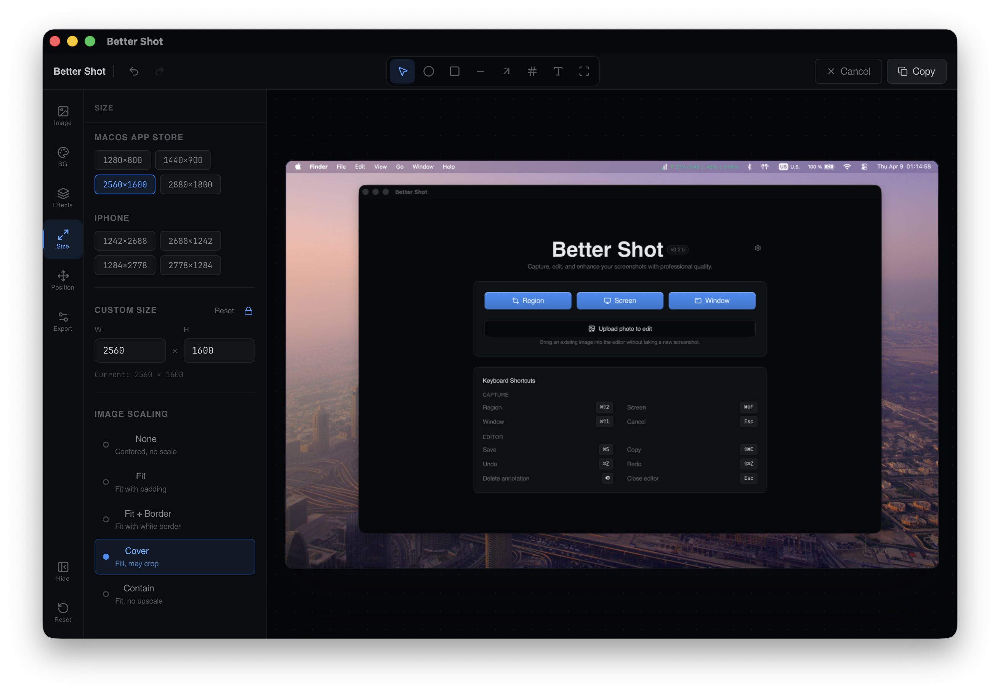
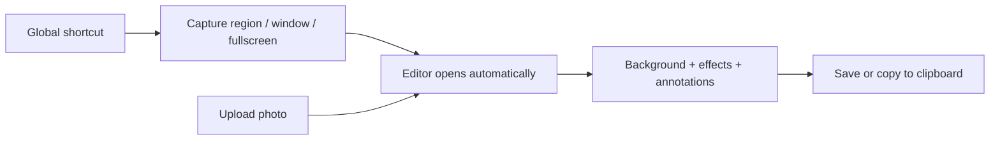

[](https://github.com/luongnv89/better-shot/stargazers)
[](./LICENSE)
[](https://github.com/luongnv89/better-shot/releases)
[](https://github.com/luongnv89/better-shot/releases)

# Capture, polish, and export — no paid tools required

Open-source macOS screenshot app with built-in background effects, annotations, and one-shortcut capture. A free alternative to CleanShot X.



[**Download for macOS →**](#install)

---

## How It Works



The editor opens immediately after every capture — no extra clicks. Existing photos can be dropped in via the Upload button.

## Features

| Feature | What you get |
|---|---|
| Background library | Wallpapers, Mac assets, mesh patterns, solid colors, transparent |
| Effects | Blur, noise, shadow, corner radius, border size controls |
| Annotations | Arrows, shapes, text, auto-numbered badges — all moveable and resizable |
| Upload photo | Edit any existing image, not just fresh captures |
| Global shortcuts | `⌘⇧2` captures from anywhere, even when the app is hidden |
| Clipboard export | `⇧⌘C` copies directly — no save dialog needed |
| Native performance | Rust + Tauri — no Electron overhead |
| Local-only | Nothing leaves your machine |

## Install

**Homebrew (recommended):**

```bash
brew install --cask bettershot
```

**DMG download:**

Go to [Releases](https://github.com/luongnv89/better-shot/releases) and download:
- Apple Silicon (M1–M5): `bettershot_*_aarch64.dmg`
- Intel: `bettershot_*_x64.dmg`

On first launch, grant **Screen Recording** permission in System Settings → Privacy & Security → Screen Recording.

## Quick Start

1. Launch Better Shot (Applications or menu bar icon)
2. Press `⌘⇧2` to capture a region
3. Adjust background, effects, and annotations in the editor
4. Press `⌘S` to save or `⇧⌘C` to copy to clipboard

## Keyboard Shortcuts

### Capture

| Action | Shortcut |
|---|---|
| Capture region | `⌘⇧2` |
| Capture fullscreen | `⌘⇧F` (enable in Preferences) |
| Capture window | `⌘⇧D` (enable in Preferences) |
| Cancel selection | `Esc` |

### Editor

| Action | Shortcut |
|---|---|
| Save image | `⌘S` |
| Copy to clipboard | `⇧⌘C` |
| Undo | `⌘Z` |
| Redo | `⇧⌘Z` |
| Delete annotation | `Delete` / `Backspace` |
| Close editor | `Esc` |

---

<details>
<summary>Build from source</summary>

**Requirements:** Node.js 18+, pnpm, Rust (latest stable)

```bash
git clone https://github.com/luongnv89/better-shot.git
cd better-shot
```

```bash
pnpm install
```

```bash
pnpm tauri build
```

The installer lands in `src-tauri/target/release/bundle/`.

</details>

<details>
<summary>Development</summary>

```bash
pnpm tauri dev
```

Other commands:

```bash
pnpm lint:ci
pnpm test:rust
pnpm tauri build
```

</details>

<details>
<summary>Contributing</summary>

Contributions are welcome. Read [CONTRIBUTING.md](CONTRIBUTING.md) before submitting a pull request.

</details>

<details>
<summary>Star history</summary>

<a href="https://www.star-history.com/#luongnv89/better-shot&type=date&legend=top-left">
 <picture>
   <source media="(prefers-color-scheme: dark)" srcset="https://api.star-history.com/svg?repos=luongnv89/better-shot&type=date&theme=dark&legend=top-left" />
   <source media="(prefers-color-scheme: light)" srcset="https://api.star-history.com/svg?repos=luongnv89/better-shot&type=date&legend=top-left" />
   
 </picture>
</a>

</details>

---

**[Read the docs](./CONTRIBUTING.md) · [Open an issue](https://github.com/luongnv89/better-shot/issues) · BSD-3 Licensed**
