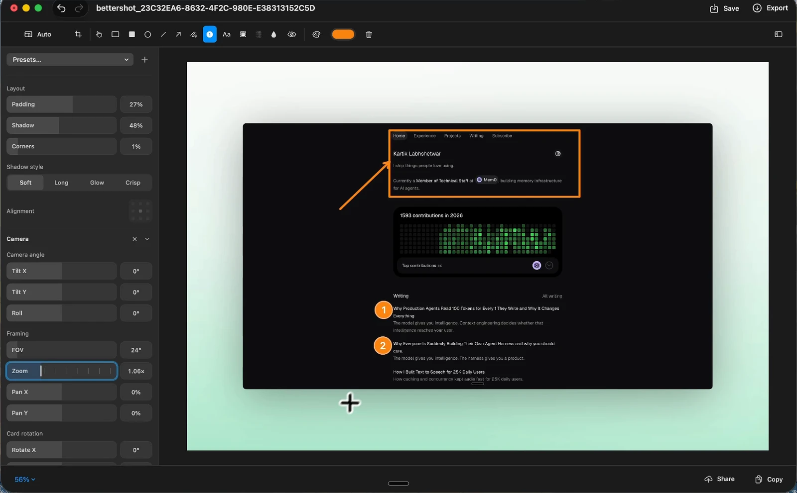
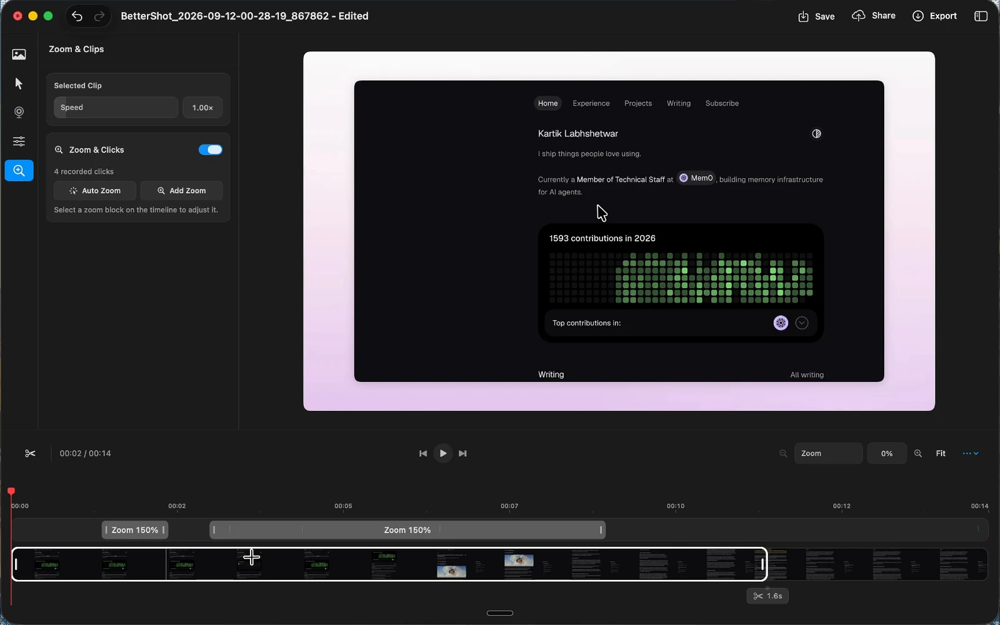

<p align="center">
  
</p>

# BetterShot

**Capture, edit, and share your screen. Native on macOS.**

BetterShot brings screenshots, screen recording, and image and video editing into
one open-source Mac app. Annotate a bug report, record a walkthrough with your
camera, or turn a capture into something ready to share. No BetterShot account
or subscription required.

[](https://formulae.brew.sh/cask/bettershot)
[](https://github.com/KartikLabhshetwar/better-shot/actions/workflows/build.yml)
[](LICENSE)

[Download](https://github.com/KartikLabhshetwar/better-shot/releases/latest) ·
[Website](https://bettershot.site) · [Changelog](CHANGELOG.md) ·
[Contribute](CONTRIBUTING.md) ·
[Report a bug](https://github.com/KartikLabhshetwar/better-shot/issues)



## Install

Requires **macOS 26 or later**.

With [Homebrew](https://formulae.brew.sh/cask/bettershot):

```bash
brew install --cask bettershot
```

Or download the `.dmg` for your Mac from
[Releases](https://github.com/KartikLabhshetwar/better-shot/releases/latest), drag
**BetterShot** into **Applications**, and open it. First launch walks you through
permissions and your first capture.

## What you can do

- **Capture anything on screen.** Take region, window, or fullscreen screenshots;
  extract text with OCR; pick a color as a hex value.
- **Annotate and frame images.** Add arrows, shapes, text, numbered markers, and
  highlights. Blur or pixelate sensitive details, crop, rotate, and flip. Add a
  wallpaper or soft gradient with adjustable padding, corners, and shadows.
- **Record a walkthrough.** Capture a display, window, or adjustable area with
  optional system audio, microphone, camera, and teleprompter. Pause and resume
  from the compact recording bar.
- **Edit the recording.** Cut clips, adjust speed from 0.25× to 8×, add zooms,
  transitions, captions, and blur or pixelate masks. Arrange screen and camera
  in a bubble, overlapping frame, side-by-side layout, or presenter view.
- **3D video shots.** Use the timeline’s **+ Add > 3D Shot** menu, then choose
  from eight camera moves and five drifting angles in Effects. Adjust camera
  orbit, screen fold, distance, and lens, or generate a scene. The same menu adds
  zoom segments. **Auto Scene** previews a sequence before applying it, keeps
  generated shots at least one second long, and snaps nearby boundaries to clip cuts.
  Looks, Camera, Depth Blur, Keyframes, and Timing stay expanded in separate cards,
  with fixed shortcuts to jump straight to each section. Fold and lens controls
  are directly visible, and animated properties have one-click curve selection.
  Compare Start/End thumbnails, drag the orbit preview, and refine exact angles
  with the tilt sliders. Scene cards show their shot counts; depth blur has a
  separate enable switch and focus selection.
  Controls include radial/directional/tilt-shift focus, bokeh highlights, and editable
  Bézier curves. Preview and export share
  the GPU compositor. Zoom enlarges the whole 3D card; separate entry/exit controls
  ease the camera into and out of its shot.
- **Make the cursor easier to follow.** Choose Recorded, Arrow, Dark, Light, or
  Dot, with size, smoothing, click effects, and idle hiding. Cursor restyling
  requires a recorded pointer track; it cannot replace a cursor baked into
  imported footage.
- **Keep captures within reach.** Copy, save, pin, edit, share, or drag from the
  floating capture deck. Find screenshots, recordings, and saved share links in
  Media Gallery's searchable icon and list views.
- **Export or share.** Export video as MP4 or MOV at 30 or 60 fps, with resolution
  and quality controls. Optional cloud sharing uploads to your own Cloudflare
  R2 bucket and copies a link.

Set a reusable **Default Look** in Settings > General for new screenshots and
videos, or choose **No Background** to keep them unframed. Original captures and
source movies remain available for editing, with undo and redo in both editors.

<details>
<summary>See the video editor</summary>



</details>

## Your first capture

1. Open BetterShot and allow screen capture when prompted. Enable Accessibility
   to use global shortcuts.
2. Press **⌘⇧4** and select a region, or **⌘⇧2** to open the capture and recording bar.
3. Use the floating preview to **Copy**, **Save**, **Pin**, or **Edit** your capture.
   **Share** becomes available after you configure cloud sharing.

### Default shortcuts

| Action | Shortcut |
| --- | --- |
| Region screenshot | `⌘⇧4` |
| Fullscreen screenshot | `⌘⇧3` |
| Capture and recording bar | `⌘⇧2` |
| Recording options | `⌘⇧5` |
| OCR text scan | `⌘⇧O` |
| Color picker | `⌘⇧C` |

Customize bindings in **Settings > Shortcuts**, including editor tools and
additional capture and recording actions. Some actions start unassigned.

### Where screenshots go

Captures start in BetterShot's private working storage. **Copy** puts an image on
the clipboard without creating a file in your configured save folder. Editing,
pinning, and sharing also keep their working files inside the app.

**Save** writes a file to your configured folder. In the image editor, it works
before you make any edits and updates the associated file on subsequent saves.
**Export** lets you choose a new destination.

Automatic screenshot saving is **off by default**. Enable it under
**Settings > General > Saving** to save normal captures while keeping the preview
or editor available. Explicit Capture & Copy, Edit, and Pin shortcuts bypass it.
The same settings section lets you customize file names with templates such as
`standup-{date}-{counter:3}`.

### Permissions

BetterShot explains each permission during setup. You can manage access later in
**System Settings > Privacy & Security**.

| Permission | Used for |
| --- | --- |
| Screen & System Audio Recording | Screenshots, screen recording, and optional system audio |
| Accessibility | Global shortcuts from other apps |
| Input Monitoring | Precise cursor effects and shortcut overlays; plain typing is not recorded |
| Microphone | Optional voice recording |
| Camera | Optional camera recording |

If capture or shortcuts still do not work after granting access, save your work,
quit BetterShot, and reopen it. Check **Settings > Shortcuts** for disabled or
conflicting bindings.

## Cloud sharing

Capturing and editing work locally. Sharing is optional and uses a Cloudflare
account and R2 storage that you manage.

1. Create an R2 bucket with a public address, and an
   [R2 API token](https://developers.cloudflare.com/r2/api/tokens/) with
   **Object Read & Write** permission scoped to that bucket.
2. In **Settings > Sharing**, enter your Account ID, Access Key ID, Secret Access
   Key, Bucket, and HTTPS Public Bucket URL.
3. Click **Test Connection**. A successful test enables **Upload when I share**.
4. Choose **Share** from a capture or editor to upload and copy its link.

Credentials are stored in your Mac's login Keychain. Shared media is served from
your bucket. By default, links open a viewer on `bettershot.site`; enable
**Copy direct file links** for the raw file URL, useful in Markdown or embeds.
Shared links are publicly accessible to anyone who has the link.

The app also contacts GitHub to check for updates and download releases.

## Automate captures

Use the `bettershot://` URL scheme from Shortcuts, Raycast, Alfred, or a shell:

```bash
open 'bettershot://capture/region'
```

Supported actions: `capture/region`, `capture/fullscreen`, `capture/window`,
`ocr`, `color-picker`, `record`, and `settings`.

## Build from source

Requires **macOS 26+**, **Xcode 26+** with its command-line tools selected, and
**XcodeGen**.

```bash
brew install xcodegen
git clone https://github.com/KartikLabhshetwar/better-shot.git
cd better-shot
make release
open .build/Build/Products/Release/BetterShot.app
```

`make release` builds unsigned and does not require the maintainer's signing
identity. The app uses SwiftUI and AppKit, with
[DockProgress](https://github.com/sindresorhus/DockProgress) and a locally adapted
[TourKit](Vendor/TourKit/BETTERSHOT.md) Swift package. The website is a separate Next.js project.

See [CONTRIBUTING.md](CONTRIBUTING.md) for Xcode setup, the code map, tests, and
submission guidance.

### Guided setup and update notes

New installs open a short TourKit guide, followed by optional permissions and a
practice capture. Use **Settings → About → Take the Tour** to revisit it.
After an update, **What’s New** shows the bundled changelog once, including releases
you skipped. It also stays available in Settings → About. Closing update notes
continues your usual capture-bar startup preference; completed setup is preserved.

Hover over empty space in the video editor’s 3D timeline to see where a shot will
fit before clicking. The dashed preview shows its duration; hovering never saves
an effect. The **+ Add** menu remains available for Zoom and 3D Shot.

The Scenes buttons show each scene’s camera sequence and shot count before
replacing the selected shot. Both editors support the green window button for
native full screen; **Settings → General → Open editors in full screen** controls
whether new editor windows enter it automatically.


## Help and contribute

Found a bug or have an idea? [Open an issue](https://github.com/KartikLabhshetwar/better-shot/issues)
with your macOS and BetterShot versions, what you expected, and steps to reproduce.
Screenshots or short recordings help; remove private information before posting.

Code, documentation, reproducible bug reports, and accessibility feedback are all
welcome. Start with the [contributor guide](CONTRIBUTING.md) and follow our
[Code of Conduct](CODE_OF_CONDUCT.md).

Built by [Kartik Labhshetwar](https://x.com/code_kartik) and
[contributors](https://github.com/KartikLabhshetwar/better-shot/graphs/contributors).
If BetterShot helps you, you can [support its development](https://www.buymeacoffee.com/code_kartik).

## License

[BSD 3-Clause](LICENSE) for original BetterShot code; adapted Cap rendering uses
AGPLv3. See [third-party notices](Resources/Licenses/NOTICE.md) for distribution
terms and the bundled TourKit MIT license.

### Optional notch mode (v0.5.5)

In **Settings > General > Capture Mode**, choose **Normal Mode** (the default)
or **Notch Mode**. Notch mode puts the capture tools, recording controls,
image/video previews, and transfer status at the top of the capture display.
Use the preview actions to Copy, Save, Edit, Pin, Cloud Share, or Dismiss; arrow
buttons browse pending captures. New Capture opens the shared capture tools.
The image and video editors still open in their full editing windows.

On a notched display, Collapse hides the expanded controls; hover or click either
side to reopen them. Other displays use a floating panel at the top. Pending
captures remain until you act on them. Switching back restores your normal overlay
layout and timing. Capture exclusion and private staging work in both modes.
